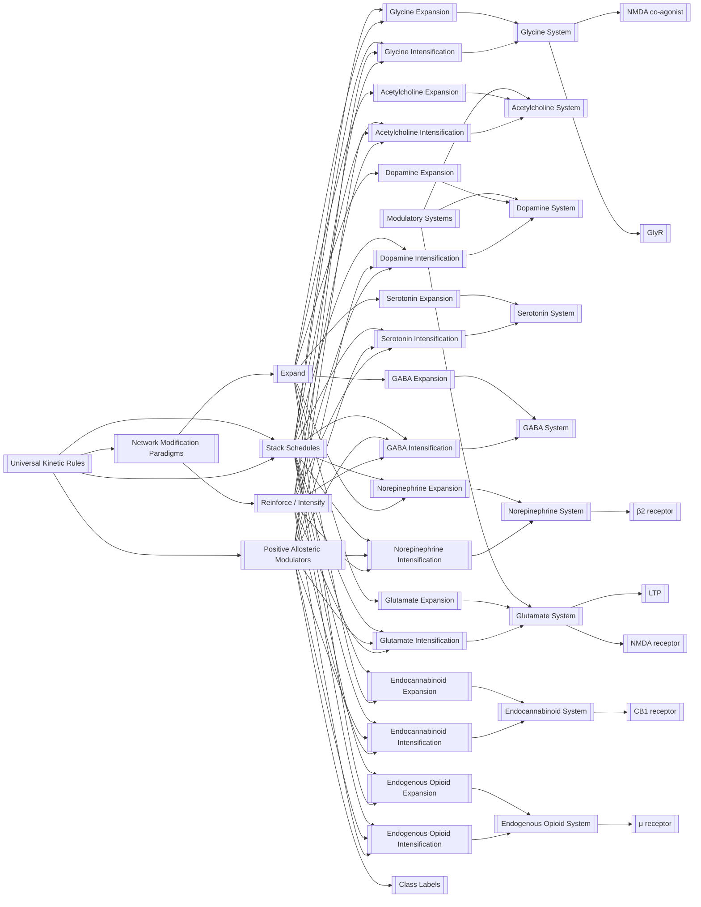

# Concept Map

Link each idea to [[Glossary]] and to the chapter that teaches it.

```mermaid
flowchart LR
  P[[Network Modification Paradigms]] --> R[[Reinforce / Intensify]]
  P --> E[[Expand]]
  R --> GI[[Glutamate Intensification]]
  R --> AI[[Acetylcholine Intensification]]
  R --> DI[[Dopamine Intensification]]
  R --> SI[[Serotonin Intensification]]
  R --> BI[[GABA Intensification]]
  E --> GE[[Glutamate Expansion]]
  E --> AE[[Acetylcholine Expansion]]
  E --> DE[[Dopamine Expansion]]
  E --> SE[[Serotonin Expansion]]
  E --> BE[[GABA Expansion]]
  GI --> G[[Glutamate System]]
  GE --> G
  AI --> A[[Acetylcholine System]]
  AE --> A
  DI --> D[[Dopamine System]]
  DE --> D
  SI --> S[[Serotonin System]]
  SE --> S
  BI --> B[[GABA System]]
  BE --> B
  R --> GI2[[Glycine Intensification]]
  E --> GE2[[Glycine Expansion]]
  GI2 --> G2[[Glycine System]]
  GE2 --> G2
  G2 --> NMDA2[[NMDA co-agonist]]
  G2 --> GlyR[[GlyR]]
  PAM --> GI2
  K --> SS
  SS --> GI2
  SS --> GE2
  M[[Modulatory Systems]] --> A
  M --> D
  M --> G
  R --> NI[[Norepinephrine Intensification]]
  E --> NE[[Norepinephrine Expansion]]
  NI --> N[[Norepinephrine System]]
  NE --> N
  N --> β2[[β2 receptor]]
  PAM --> NI
  SS --> NI
  SS --> NE
  R --> EI[[Endocannabinoid Intensification]]
  E --> EE[[Endocannabinoid Expansion]]
  EI --> EC[[Endocannabinoid System]]
  EE --> EC
  EC --> CB1[[CB1 receptor]]
  PAM --> EI
  SS --> EI
  SS --> EE
  R --> OI[[Endogenous Opioid Intensification]]
  E --> OE[[Endogenous Opioid Expansion]]
  OI --> OP[[Endogenous Opioid System]]
  OE --> OP
  OP --> μ[[μ receptor]]
  PAM --> OI
  SS --> OI
  SS --> OE
  G --> LTP[[LTP]]
  G --> NMDA[[NMDA receptor]]
  PAM[[Positive Allosteric Modulators]] --> GI
   PAM --> CL[[Class Labels]]
  PAM --> AI
  PAM --> DI
  PAM --> SI
  PAM --> BI
  K[[Universal Kinetic Rules]] --> P
  K --> PAM
  K --> SS[[Stack Schedules]]
  SS --> GI
  SS --> AI
  SS --> DI
  SS --> SI
  SS --> BI
```

[[References]] · [[Home]]